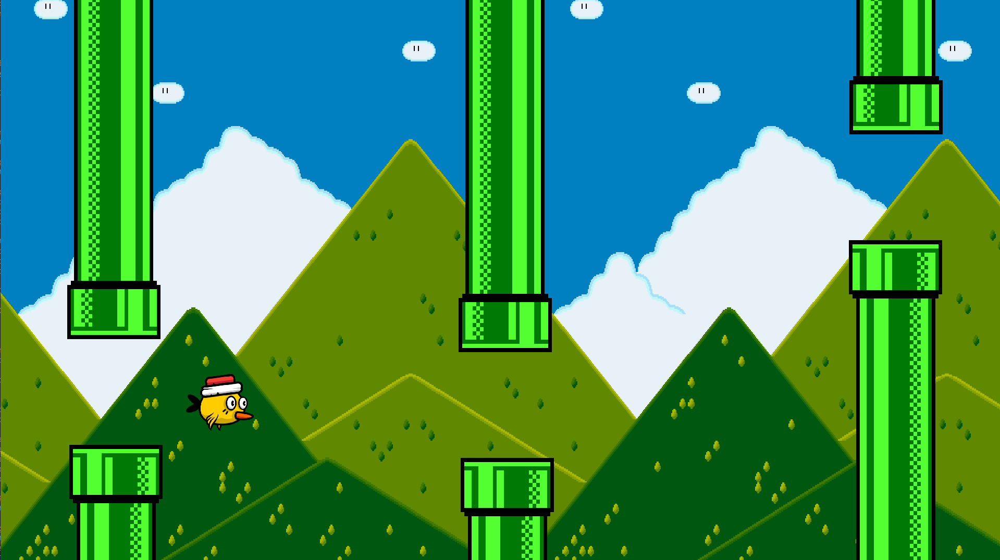
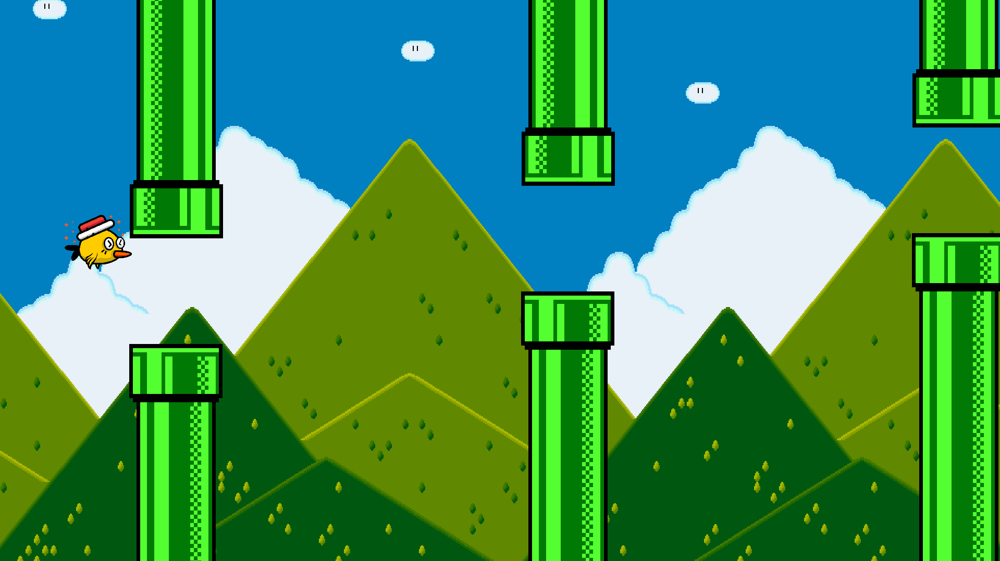

[](https://dev.azure.com/thomassedlmair/ezEngine/_build/latest?definitionId=6&branchName=master)

# ezEngine - 2D Game Engine
  
Welcome to my 2D Game Engine! This game engine is still under development. The long term goal is to create different games by using different interfaces. Aside there will be an artificial intelligence which learns how to play chess (therefore i started implementing a chess game) against human players or another AI. Before starting with AI this will be a coding playground. first of all this will be a independent 2D game engine with an different interfaces (dll, python, lua) and an implemented chess game.
  

## ezEngine Documentation

This engine works with an Entity-Component-System which is illustrated below (simplified). 

1. Each entity is represented as an id, as just a integer number. 
2. Each Entity can have multiple components. 
3. The components are just plain data, no logic. 
4. Each component is handled by a component manager (instantiated inside singelton class Components, see `./Components/Components.hpp`).
5. Components are modified by the systems, which means one system can modify multiple components.
6. All systems inherit from the same interface, to store them in a container inside the Systemsmanager, see `./Systems/SystemManager.hpp`. 
  
    

  


## Build 
There are different targets in the makefile. If there are permission issues by copying to /usr/lib or loading the shared library run with `sudo`.

1. Install the external dependencies
````
sudo apt install libsdl2-dev
sudo apt install libsdl2-image-dev
sudo apt install libsdl2-ttf-dev
sudo apt install libsdl2-mixer-dev
sudo apt install liblua5.3-dev
sudo apt-get install libboost-all-dev
apt-get install python-dev
sudo apt install python3.8
````

2. Run `make all` to builds the engine, the python api and the chess example
3. Run `make install` copy shared library to /usr/lib and ./examples/pyBird


## Examples

On the current state of this project there are two examples.

### Chess Example

By running `make run_chess` the Chessgame starts. It's a C++ implementation which uses the ezEngine. All game rules aren' implemented. A running game looks like:


  
### pyBird

Long time goal is to create a flappy bird game with python. Currently, first implementation for the python API done. Run the script `python3.8 ./examples/pyBird/pyBird.py`. This will create a flappy bird game. The bird controls are implemented in `./assets/scirpts/playerMovement.lua` and can easily changed since this script will be executed during runtime.
  
Note: this is a first naive approach of the game with keyboard keys a and d for moving left right and clicking for upwards movement






## Known Issues

- proper position control (refactor 2point control, chess figure jiggles on arriving at given square)
- layer rendering of spritesystem