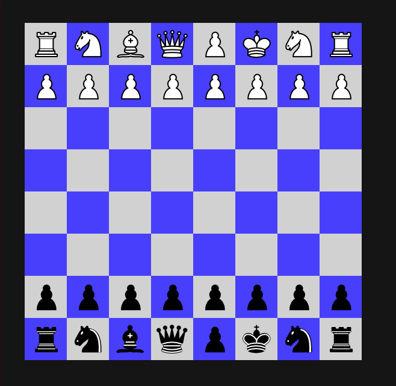

[](https://dev.azure.com/thomassedlmair/SimpleChess/_build/latest?definitionId=3&branchName=dev)

# Simple Chess Game 

Simple Chess Game under development
  
First setup with chess figures 




Next Steps:
- select desired figure by clicking
- move selected figure
- setup chessboard with figures
- specific movments for each figure

Optimizing:
- moving figures diagonal (slower speed on the shorter axis)
- click event delayed only on vm???
- ... 

## External Libraries

````
sudo apt install libsdl2-dev
sudo apt install libsdl2-image-dev
sudo apt install libsdl2-ttf-dev
sudo apt install libsdl2-mixer-dev
sudo apt install liblua5.3-dev
sudo apt-get install libboost-all-dev
````