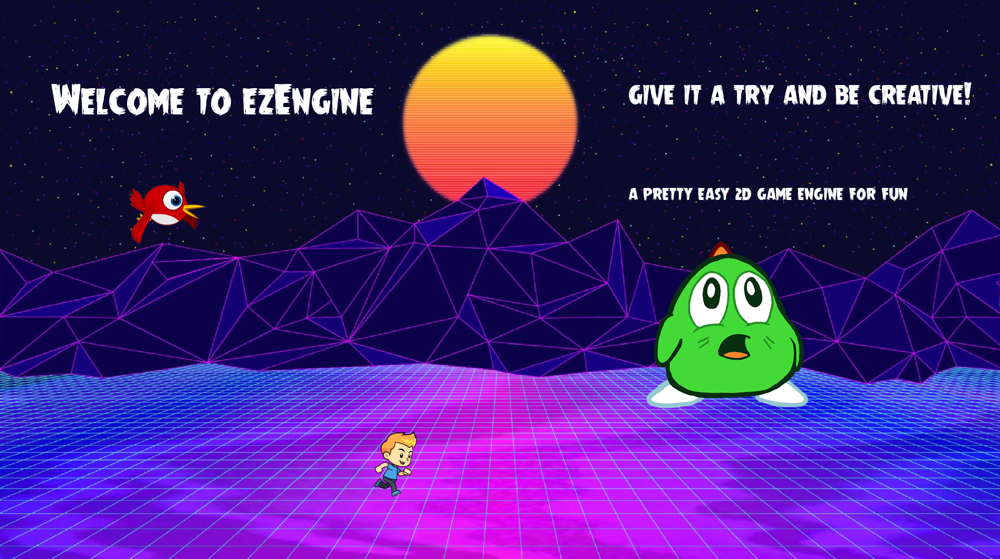
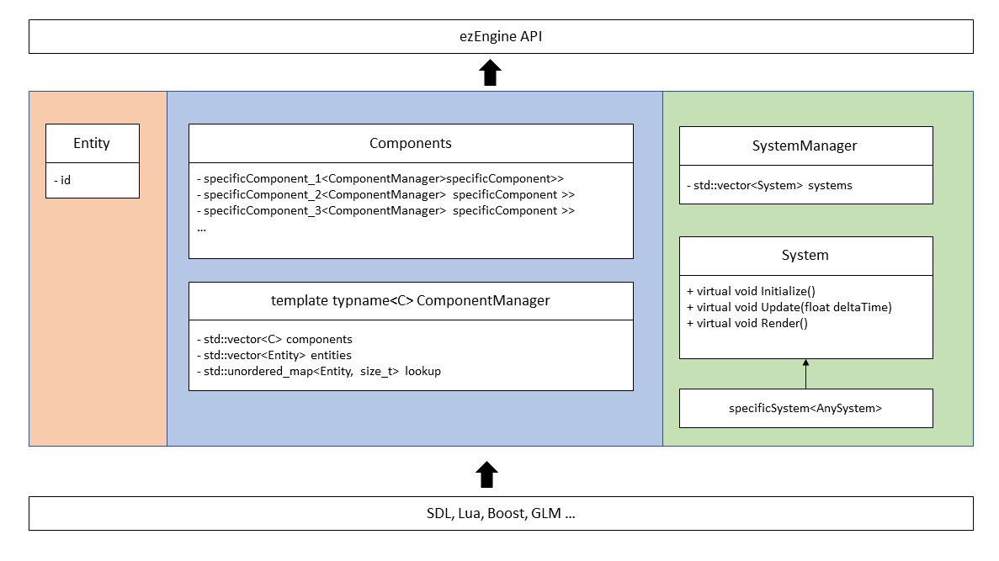
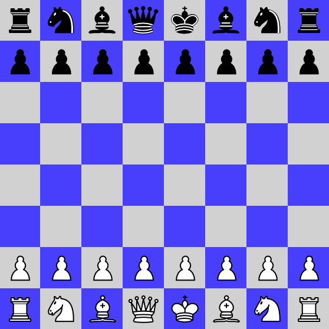
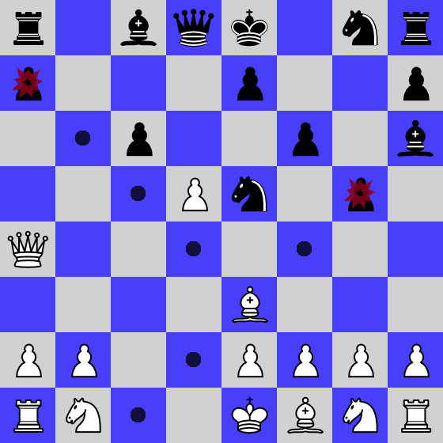
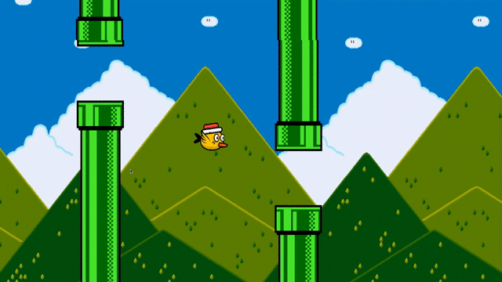
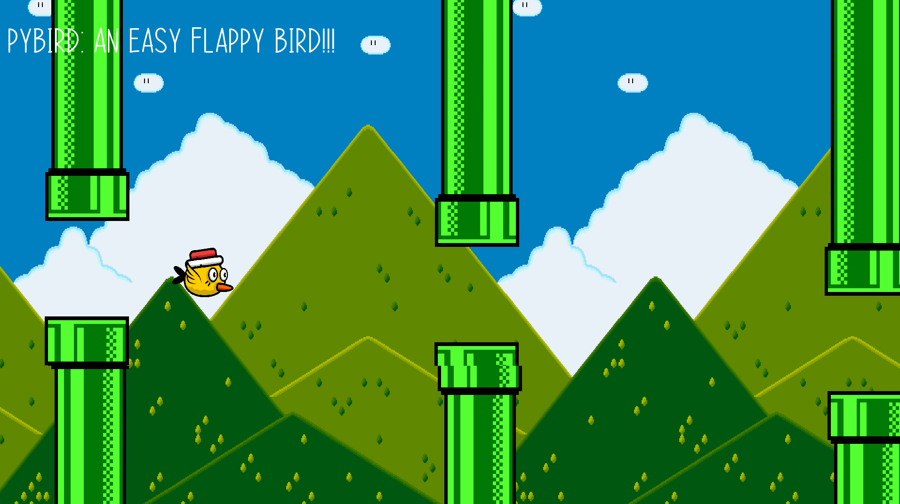
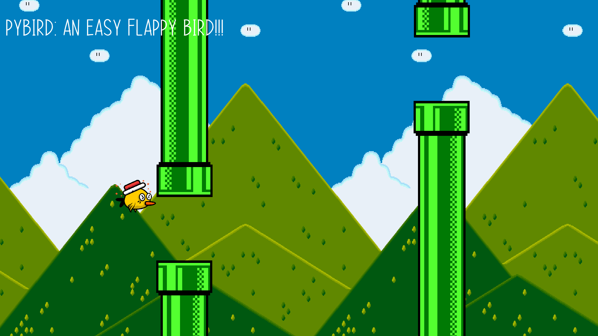

[](https://dev.azure.com/thomassedlmair/ezEngine/_build/latest?definitionId=6&branchName=master)

# ezEngine - 2D Game Engine
  
Welcome to my 2D Game Engine! This game engine is still under development. The long term goal is to create different games by using different interfaces. Aside there will be an artificial intelligence which learns how to play chess (therefore i started implementing a chess game) against human players or another AI. Before starting with AI this will be a coding playground. first of all this will be a independent 2D game engine with an different interfaces (dll, python, lua) and an implemented chess game.
  
  

  
  
## ezEngine Documentation

This engine works with an Entity-Component-System which is illustrated below (simplified). 

1. Each entity is represented as an id, as just a integer number. 
2. Each Entity can have multiple components. 
3. The components are just plain data, no logic. 
4. Each component is handled by a component manager (instantiated inside singelton class Components, see `./Components/Components.hpp`).
5. Components are modified by the systems, which means one system can modify multiple components.
6. All systems inherit from the same interface, to store them in a container inside the Systemsmanager, see `./Systems/SystemManager.hpp`. 
  
  


  
All given API function are defined in `./api/ezEngine.hpp`. A description will follow. For now see the two examples, this readme or the function singatures how to use.
  
  
To create a game there is only the api needed. For instance we want to create an Entity and assign some components like:  
  

C++ :
````
...
// create an entity
auto newEntity = ezEngine::CreateEntity();

// add one or more components to it 
ezEngine::Sprite::Create(...);
ezEngine::Transform::Create(...);
ezEngine::Collider::Create(...);
...
````
  
Python (see `./examples/pyBird/pyBird.py`):
````
...
#create an entity
newEntity = ezPyEngine.CreateEntity()

# add some components to the entity
ezPyEngine.SpriteComponent.Create(...)
ezPyEngine.TransformComponent.Create(...)
ezPyEngine.UserInputComponent.Create(...)
ezPyEngine.ColliderComponent.Create(...)
....
````

## Components

Within this section the provided components are described. Every component holds the entity to which it belongs to as owner. 
  
Any component can created by the corresponding Create() function on the api. So for instance a sprite component would be created as following.

````
// C++ 

// add your sprite 
ezEngine::AddTexture("YOUR_ID", "PATH_TO_THE_IMAGE");

// create an enttiy
auto newEntity = ezEngine::CreateEntity();

// create a sprite component
ezEngine::Sprite::Create(
    newEntity,
    "YOUR_ID",
    ezEngine::Rectangle{...}, // source position in given sprite file
    ezEngine::Rectangle{...}, // destination position in game
    ezEngine::Sprite::Flip::none, 
    ezEngine::Sprite::Layer::layer_0 
);


# Python:
ezPyEngine.AddTexture("YOUR_ID", "PATH_TO_THE_IMAGE")
# add your sprite

# create Entity
newEntity = ezPyEngine.CreateEntity()
# create a entity
ezPyEngine.SpriteComponent.Create(newEntity, "YOUR_ID", ezPyEngine.Rectangle(source position), ezPyEngine.Rectangle(destination position in game), ezPyEngine.Sprite.Layer.layer_0)

````
  
### SpriteComponent
Every information to render an image/sprite in the SpriteSystem. To access given sprites it is mandatory to add the image with an id to the assetmanager.  

**Affected by:** 
- TransfromComponent: sets destination rectangle
  
**Datafields:**
- Entity: owner 
- String: textureId -> id which was passed to the assetmanager
- Rectangle: source -> source rectangle of provided image
- Rectangle: destination -> destination where it should be rendered in the game
- Flip: flip -> none, horizontal or vertical flip (defined enum in api)
- Layer: layer -> rendering layer in ascending order

### TransformComponent
Transform represents 2d coordinates and size of an arbitrary component. If the same entity has a sprite component, sprites destination rectangle will be overwritten by position, width and height from this transform component. To move an object around, velocity needs to set. 

**Affected by:** 
- UserInputComponent: sets velocity 
- PositionComponent: sets velocity

**Datafields:**
- Entity: owner
- Vector2d: position
- Vector2d: velocity
- Integer: width
- Integer: heigth
- Integer: scale


### PositionComponent
Moves a transform component to a specific location.
   
**Requires:**
- TransformComponent
  
**Datafields:**
- Entity: owner
- Vector2d: setPosition 
- Vector2d: velocity

### UserInputComponent
Moves a transform component around by user inputs (keyboard or mouse). To map all keys to game specific movements / actions write a short Lua script. The Lua script has access to all user inputs (see `./Userinputs.hpp`)
   
  
Example for scripting (see `./examples/pyBird/assets/scripts/playerMovement.lua`):
````
-- lua scripting for user inputs
-- get instance of all user inputs
local inputs = UserInputs.GetInstance()

-- set velocity x and y like following
if inputs.keyboard_a == true then
    velocity["x"] = -800
elseif inputs.keyboard_d == true then
    velocity["x"] = 800
else    
    velocity["x"] = 0
end
````
  
**Datafields:**
- Entity: owner
- String: inputScript -> relativ path to script location


### ColliderComponent
Colliders are checking if transform components colliding with each other.
  
**Requires:**
- TransformComponent
  
**Datafields:**
- Entity: owner
- String: type -> arbitrary type which can passed by the user
- Bool: active -> inactive (False) collision aren't detected
- Bool: collision -> True / False if a collision is detected
- String: collisionWithType -> holds the type of a collided component in case of a collision
  
### TextlabelComponent
Display customized Textlabels. It is mandatory to provide the font (*.ttf) to the assetmanager. Use the api function `ezEngine::AddFont(fontId, filePath, fontSize)`. The textlabel components itself looks like the following.
  
**Datafields:**
- Entity: owner
- Rectangle position
- String text -> displayed text
- String fontId -> which was passed to the assetmanager
- Color -> ezEngine::Color with red, green, blue, alpha (each 0-255)

### TileComponent
to be implemented

 
  

## Build 
There are different targets in the makefile. If there are permission issues by copying to /usr/lib or loading the shared library run with `sudo`.

1. Install the external dependencies
````
sudo apt install libsdl2-dev
sudo apt install libsdl2-image-dev
sudo apt install libsdl2-ttf-dev
sudo apt install libsdl2-mixer-dev
sudo apt install liblua5.3-dev
sudo apt-get install libboost-all-dev
apt-get install python-dev
sudo apt install python3.8
````

2. Run `make all` to builds the engine, the python api and the chess example
3. Run `make install` copy shared library to /usr/lib and ./examples/pyBird


## Examples

On the current state of this project there are two examples.

### Chess Example

By running `make run_chess` the Chessgame starts. It's a C++ implementation which uses the ezEngine. All game rules aren' implemented. A running game looks like:



  
### pyBird

Long time goal is to create a flappy bird game with python. Currently, first implementation for the python API done. Run the script `./examples/pyBird/pyBird.py`. This will create a flappy bird game. The bird controls are implemented in `./assets/scirpts/playerMovement.lua` and can easily changed since this script will be executed during runtime.
  
Note: this is a first naive approach of the game with keyboard keys a and d for moving left right and clicking for upwards movement







## Known Issues

- add a collision rectangle to have some more space 
- proper position control (refactor 2point control, chess figure jiggles on arriving at given square)
